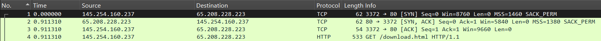
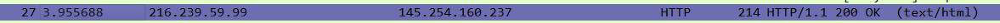
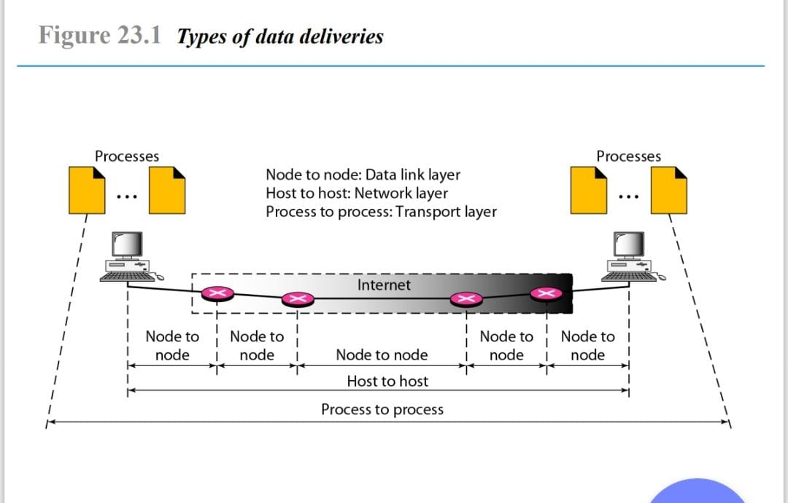

# Laporan Praktikum Workshop Administrasi Jaringan - Wireshark

  

## Dosen Pengampu  
**Dr. Ferry Astika Saputra, ST, M.Sc**  

## Disusun Oleh  
- **Nama**: Muhammad Arief Wicaksono Putra Santoso  
- **Kelas**: 2 D3 IT A  
- **NRP**: 3123500022  
- **Program Studi**: D3 Teknik Informatika  
- **Politeknik Elektronika Negeri Surabaya**  
- **Tahun Ajaran**: 2025/2026  

---

## **Judul: Tugas Reviu**  

### **Deskripsi**  
1. **Analisa file http.cap dengan Wireshark**  
   - **Versi HTTP yang digunakan**  
   - **IP Address dari Client maupun Server**  
   - **Waktu dari Client mengirimkan HTTP Request**  
   - **Waktu dari Server mengirimkan Response dan durasinya**  

2. **Deskripsi Gambar pada Slide**  

3. **Rangkuman Tahapan Komunikasi Menggunakan TCP**  

---

## **1. Analisis HTTP Request dan Response**  

- **IP Client**: `145.254.160.237`  
- **IP Server**: `65.208.228.223`  
- **HTTP Request Start**: `0.911310`  

  

- **HTTP Response Start**: `3.955688`  

  

- **Durasi Sesi**: `4.846969 - 3.955688 = 0.891281 detik`  

---

## **2. Rangkuman Tahapan Komunikasi Menggunakan TCP**  

  

### **1. Node to Node (Lapisan Data Link)**  
- Komunikasi terjadi antara dua perangkat jaringan dalam satu jaringan fisik (LAN) atau router yang terhubung langsung.  
- Data dikirim dalam bentuk **frame** menggunakan protokol seperti **Ethernet atau Wi-Fi**.  
- Setiap perangkat dalam jalur komunikasi bertugas meneruskan data ke node berikutnya hingga mencapai tujuan.  

### **2. Host to Host (Lapisan Network)**  
- Setelah melalui beberapa node di jaringan lokal, data dikirim ke tujuan melalui **internet**.  
- **Internet Protocol (IP)** digunakan untuk menentukan alamat tujuan (IP komputer penerima).  
- Data dikemas dalam **paket IP** dan dikirim melalui router di internet untuk mencapai host tujuan.  
- Proses ini memastikan komunikasi antara dua host meskipun berada di jaringan yang berbeda.  

### **3. Process to Process (Lapisan Transport)**  
- Setelah paket data sampai ke host tujuan, komunikasi dilanjutkan ke **proses atau aplikasi yang sesuai**.  
- **Transmission Control Protocol (TCP)** digunakan untuk mengatur aliran data antara aplikasi di kedua host.  
- TCP memastikan bahwa data:  
  - Sampai dalam **urutan yang benar**.  
  - Tidak ada **data yang hilang atau rusak**.  
  - Dikirim dengan kecepatan sesuai dengan kapasitas jaringan dan penerima.  
- Contoh: Dalam komunikasi web, TCP mengirim data ke browser melalui **port 80 (HTTP) atau port 443 (HTTPS)**.  

---

## **Kesimpulan**  
Tahapan komunikasi menggunakan TCP terdiri dari tiga lapisan utama:  
1. **Node to Node** (Data Link Layer) → komunikasi antar perangkat dalam satu jaringan.  
2. **Host to Host** (Network Layer) → komunikasi antar komputer melalui internet.  
3. **Process to Process** (Transport Layer) → komunikasi antar aplikasi di komputer pengirim dan penerima menggunakan TCP.  

TCP memastikan komunikasi berjalan dengan aman, urut, dan tanpa kehilangan data.

---

**© 2025 Muhammad Arief Wicaksono Putra Santoso - Politeknik Elektronika Negeri Surabaya**
