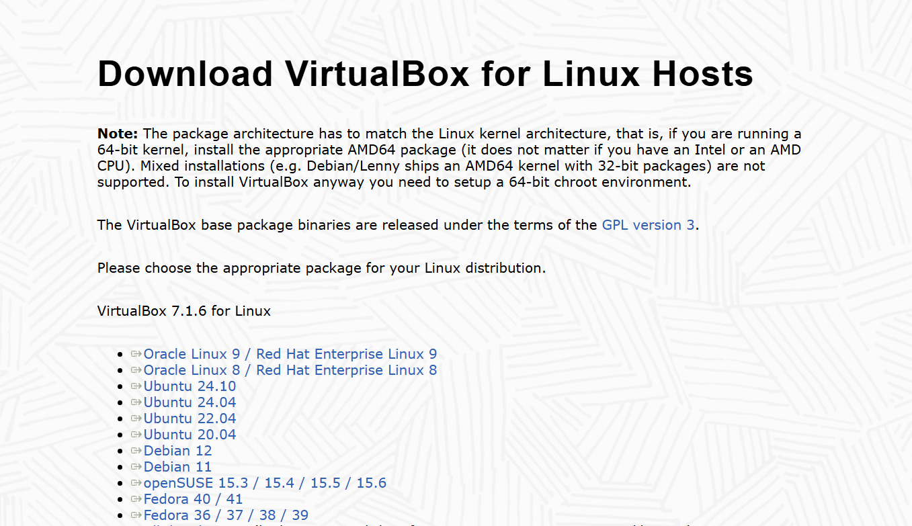
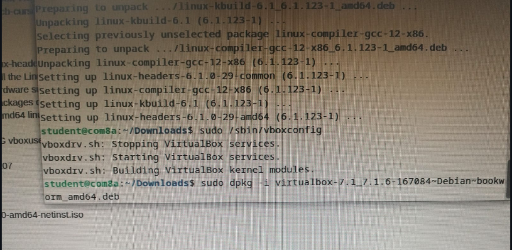
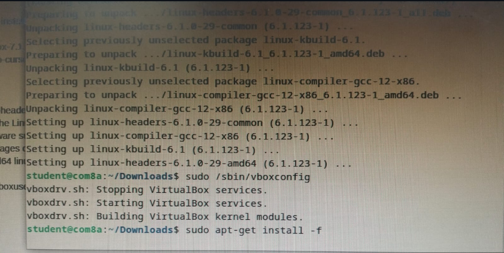
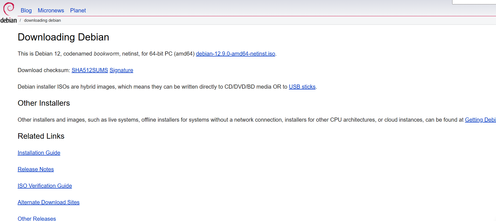
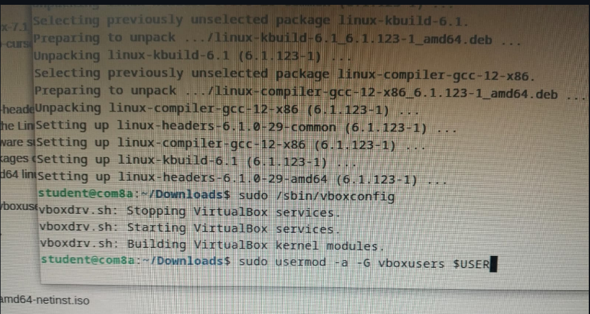
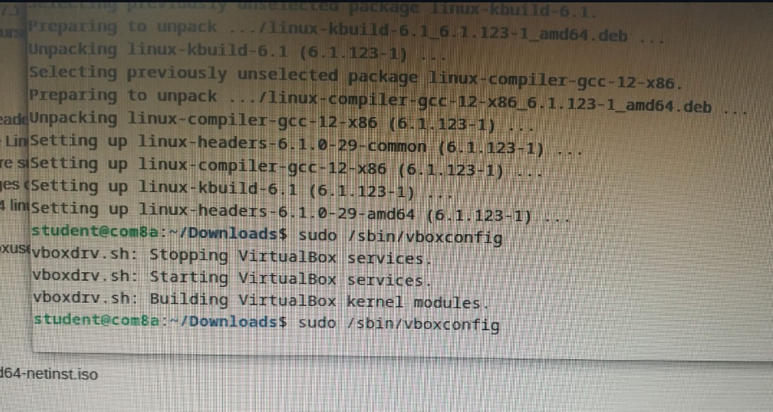
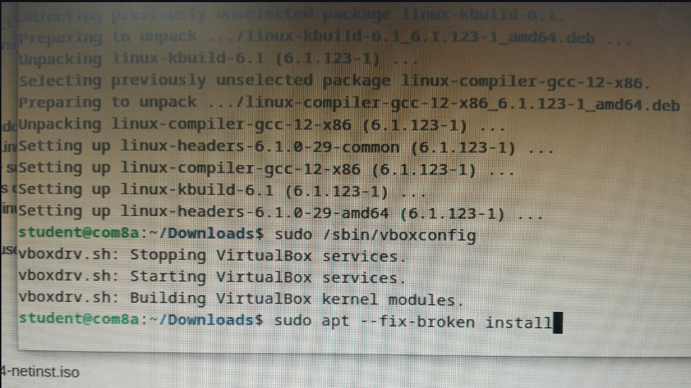
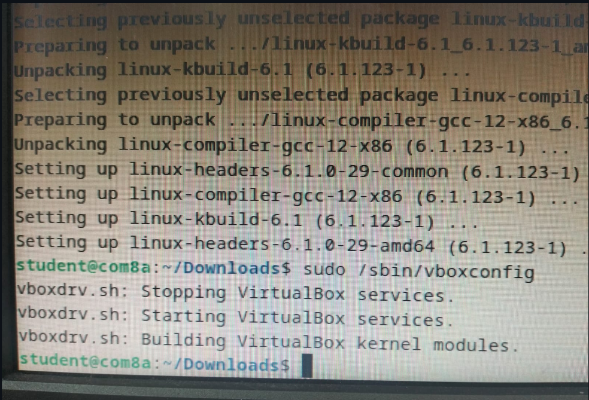

# Laporan Praktikum Workshop Administrasi Jaringan - Instalasi Virtual Box Menggunakan Lab Komputer

<p align="center">
  
</p>


## Dosen Pengampu  
**Dr. Ferry Astika Saputra, ST, M.Sc**  

## Disusun Oleh  
- **Nama**: Muhammad Arief Wicaksono Putra Santoso  
- **Kelas**: 2 D3 IT A  
- **NRP**: 3123500022  
- **Program Studi**: D3 Teknik Informatika  
- **Politeknik Elektronika Negeri Surabaya**  
- **Tahun Ajaran**: 2025/2026  

---

### **Judul: Tugas Instalasi Virtual Box Menggunakan Lab Komputer**  

1. Unduh paket VirtualBox dari laman [https://www.virtualbox.org/wiki/Linux_Downloads](https://www.virtualbox.org/wiki/Linux_Downloads), lalu pilih distribusi Linux yang sesuai. Pada lab komputer, distribusi yang digunakan adalah Debian 12.

<p align="center">
  
</p>


2. Setelah selesai mengunduh, buka terminal dan pindah ke direktori **Downloads** dengan perintah:  

```bash
cd Downloads
```

Kemudian, jalankan perintah berikut untuk menginstal VirtualBox:  
```bash
sudo dpkg -i [nama-paket-VirtualBox]
```
Penjelasan perintah:  
- `sudo` memberikan hak akses administrator.  
- `dpkg` adalah manajer paket untuk file berformat **.deb**.  
- `-i` digunakan untuk memulai proses instalasi.

<p align="center">
  
</p>

3. Saat proses instalasi, saya mengalami kendala karena terdapat dependensi yang belum terinstal. Untuk mengatasi masalah ini, saya menjalankan perintah berikut agar semua dependensi yang diperlukan dapat terpasang:  

```bash
sudo apt --fix-broken install
```

Setelah itu, saya mengulangi proses instalasi VirtualBox dengan menjalankan kembali perintah:  

```bash
sudo dpkg -i [nama-paket-VirtualBox]
```
<p align="center">
  
</p>

4. Setelah instalasi berhasil dan VirtualBox dapat dijalankan, unduh image distro yang akan digunakan dalam VirtualBox. Saya menggunakan distro Debian, yang dapat diunduh melalui laman [http://www.debian.org/download](http://www.debian.org/download).

<p align="center">
  
</p>

5. Setelah image terunduh, langkah berikutnya adalah membuat virtual machine di VirtualBox. Namun, saya mengalami error saat menekan tombol **New**, dengan keterangan bahwa pengguna belum tergabung dalam grup **vboxusers**.  

Untuk mengatasi masalah ini, saya menjalankan perintah berikut:  
```bash
sudo usermod -a -G vboxusers $USER
```
Penjelasan perintah:  
- `sudo` memberikan hak akses administrator.  
- `usermod` digunakan untuk memodifikasi akun pengguna.  
- `-a` memastikan pengguna ditambahkan ke grup tanpa menghapus keanggotaan di grup lain.  
- `-G vboxusers` menentukan grup yang akan ditambahkan.  
- `$USER` merepresentasikan akun pengguna yang sedang digunakan.

<p align="center">
  
</p>

6. Setelah menyelesaikan error terkait grup **vboxusers**, saya menghadapi error **"VirtualBox Kernel driver not installed (rc=1908)"**, yang menunjukkan bahwa kernel driver tidak dimuat atau tidak dikonfigurasi dengan benar.  

Untuk mengatasi masalah ini, saya menjalankan perintah berikut:  

```bash
sudo /sbin/vboxconfig
```

Perintah ini digunakan untuk mengonfigurasi VirtualBox sebagai administrator agar kernel driver dapat dimuat dengan benar.

<p align="center">
  
</p>

7. Saat menjalankan perintah  

```bash
sudo /sbin/vboxconfig
```  

muncul error yang menyatakan bahwa **Linux headers** tidak ditemukan.  

Untuk mengatasi masalah ini, saya menggunakan perintah berikut:  

```bash
sudo apt --fix-broken install
```  

Perintah ini berfungsi untuk memperbaiki paket yang rusak dengan menginstal dependensi yang hilang atau bermasalah.Dengan demikian, **Linux headers** dapat ditemukan dan VirtualBox dapat dijalankan

<p align="center">
  
</p>

8. Setelah menjalankan perintah  

```bash
sudo apt --fix-broken install
```  

perintah  

```bash
sudo /sbin/vboxconfig
```  

dapat dijalankan tanpa masalah. Berikut adalah contoh output jika konfigurasi berhasil:

<p align="center">
  
</p>

9. Langkah berikutnya adalah membuka kembali **VirtualBox** untuk membuat **virtual machine** menggunakan image yang telah diunduh. Konfigurasi yang digunakan meliputi:  

- **Memory**: 2048 MB  
- **CPU**: 2 core  
- **Penyimpanan**: 10 GB  

Setelah selesai mengatur konfigurasi, klik **Next** untuk memulai proses pembuatan virtual machine. Berikut adalah contoh tampilan saat proses berlangsung:

<p align="center">
  
</p>

10. Proses pembuatan virtual machine ini diperkirakan memerlukan waktu sekitar 30 hingga 60 menit.

### Kesimpulan

Dapat disimpulkan bahwa instalasi **VirtualBox** di **Linux** menggunakan **Bash Shell** berbeda dari instalasi di **Windows**. Hal ini disebabkan oleh beberapa kendala yang mungkin dialami pengguna, yang memerlukan langkah tambahan untuk mengatasi berbagai permasalahan selama proses instalasi.