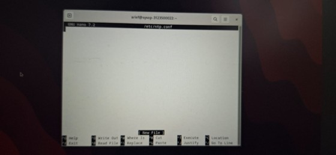

# Laporan Praktikum Workshop Administrasi Jaringan

<p align="center">
  
</p>

## Dosen Pengampu  
**Dr. Ferry Astika Saputra, ST, M.Sc**  

## Disusun Oleh  
- **Nama**: Muhammad Arief Wicaksono Putra Santoso  
- **Kelas**: 2 D3 IT A  
- **NRP**: 3123500022  
- **Program Studi**: D3 Teknik Informatika  
- **Politeknik Elektronika Negeri Surabaya**  
- **Tahun Ajaran**: 2025/2026  

---


## A. Instalasi NTP Client

### 1. Install NTP Client
```bash
sudo apt update && sudo apt upgrade -y
```

<p align="center">
  
</p>
<p align="center">
  
</p>

```bash
sudo apt install ntp ntpsec -y
```

<p align="center">
  
</p>

### 2. Konfigurasi NTP
Edit file konfigurasi:
```bash
sudo nano /etc/ntp.conf
```
<p align="center">
  
</p>

Tambahkan server NTP Indonesia:
```
server 0.id.pool.ntp.org
server 1.id.pool.ntp.org
server 2.id.pool.ntp.org
server 3.id.pool.ntp.org
```
<p align="center">
  
</p>

Simpan dan keluar (Ctrl + O, Enter, Ctrl + X).

### 3. Restart dan Verifikasi NTP Service

Restart layanan NTP:
```bash
sudo systemctl restart ntp
```
Periksa status layanan:

```
sudo systemctl status ntp
```
sudo systemctl status ntp
<p align="center">
  
</p>

Verifikasi sinkronisasi waktu:

```
ntpq -p
```
<p align="center">
  
</p>
---

## B. Instalasi dan Konfigurasi Samba

### 1. Install Samba
```bash
sudo apt install samba smbclient cifs-utils -y
```

<p align="center">
  
</p>

### 2. Membuat Public Shared Folder

Buat direktori untuk shared folder:

```bash
sudo mkdir -p /samba/public
```
<p align="center">
  

Atur izin direktori:
```
sudo chmod 777 /samba/public
```
<p align="center">
  

Edit file konfigurasi Samba:
```
sudo nano /etc/samba/smb.conf
```

<p align="center">
  


Tambahkan:
```
[Public]
path = /samba/public
browseable = yes
writable = yes
read only = no
guest ok = yes
```
Simpan dan keluar.
<p align="center">
  


### 3. Membuat Limited Shared Folder
```bash
sudo mkdir -p /samba/limited
```
<p align="center">
  
/p>
```
sudo chmod 775 /samba/limited
```
<p align="center">
  


```
sudo nano /etc/samba/smb.conf
```
Tambahkan:
```
[Limited]
path = /samba/limited
browseable = yes
writable = yes
read only = no
valid users = @sambausers
```
<p align="center">
  


Buat grup dan pengguna:
```bash
sudo groupadd sambausers
sudo usermod -aG sambausers username
sudo smbpasswd -a username
```
<p align="center">
  


Restart layanan Samba:
```bash
sudo systemctl restart smbd
```

<p align="center">
  


Setelah di Restart anda bisa melalukan Transfer file melalui samba dan NTP untuk mengatur zona waktu agar bisa menggunakan waktu indonesia. 

Tetapi di Virtual Box saya. Saya tidak bisa melakukan Testing dikarenakan Ethernet dan Wifi di Virtual Box saya Error

---


## Rangkuman Buku "The Beginner's Handbook - Debian 12 System Admin"

### BAB 1: Pendahuluan
- Debian adalah sistem operasi berbasis Linux yang stabil dan banyak digunakan.
- Keunggulan Debian 12: stabilitas tinggi, dukungan luas, sistem manajemen paket efisien, keamanan tinggi.
- Peran administrator sistem dalam mengelola server dan jaringan.

### BAB 2: Instalasi Debian 12
1. **Persiapan**
   - Unduh ISO Debian
   - Buat USB bootable (Rufus/balenaEtcher)
   - Atur BIOS/UEFI
2. **Instalasi**
   - Pilih mode instalasi (GUI/CLI)
   - Konfigurasi dasar: bahasa, zona waktu, keyboard
   - Partisi disk (ext4, swap)
   - Buat akun root & user reguler
3. **Pasca Instalasi**
   ```bash
   sudo apt update && sudo apt upgrade
   ```

### BAB 3: Manajemen Pengguna dan Izin
- **Membuat pengguna**:
  ```bash
  sudo adduser nama_pengguna
  ```
- **Menghapus pengguna**:
  ```bash
  sudo deluser nama_pengguna
  ```
- **Mengatur izin file**:
  ```bash
  chmod 755 file.txt
  chown user:usergroup file.txt
  ```

### BAB 4: Manajemen Paket dengan APT
- **Instal paket**:
  ```bash
  sudo apt install nama_paket
  ```
- **Hapus paket**:
  ```bash
  sudo apt remove nama_paket
  ```
- **Update sistem**:
  ```bash
  sudo apt update && sudo apt upgrade
  ```

### BAB 5: Konfigurasi Jaringan
- **Cek informasi jaringan**:
  ```bash
  ip a
  ```
- **Tes konektivitas**:
  ```bash
  ping google.com
  ```
- **Atur firewall**:
  ```bash
  sudo ufw allow 22/tcp
  sudo ufw enable
  ```

### BAB 6: Administrasi Sistem
- **Cek penggunaan CPU/memori**:
  ```bash
  top
  ```
- **Cek ruang penyimpanan**:
  ```bash
  df -h
  ```
- **Kelola layanan systemd**:
  ```bash
  systemctl status apache2
  systemctl start apache2
  systemctl stop apache2
  ```

### BAB 7: Keamanan Sistem
- **Instal SSH**:
  ```bash
  sudo apt install openssh-server
  ```
- **Ubah port SSH**:
  ```bash
  sudo nano /etc/ssh/sshd_config
  ```
  Ubah `Port 22` menjadi port lain.

### BAB 8: Backup dan Pemulihan
- **Backup dengan tar**:
  ```bash
  tar -czvf backup.tar.gz /home/user/
  ```
- **Sinkronisasi data dengan rsync**:
  ```bash
  rsync -av /source/ /destination/
  ```

### BAB 9: Otomatisasi Tugas
- **Menjadwalkan tugas cron**:
  ```bash
  crontab -e
  0 2 * * * /path/to/script.sh
  ```

### BAB 10: Troubleshooting dan Pemecahan Masalah
- **Cek log error**:
  ```bash
  journalctl -xe
  

