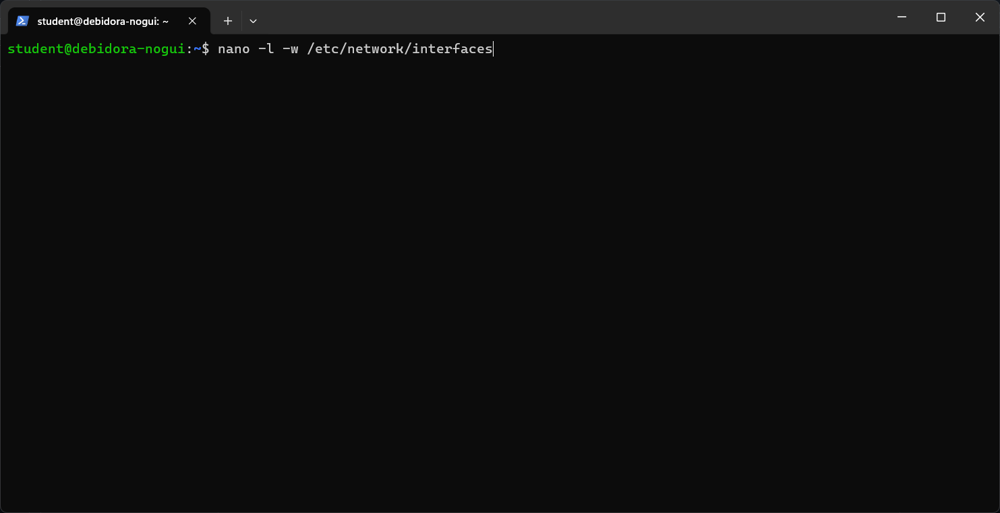
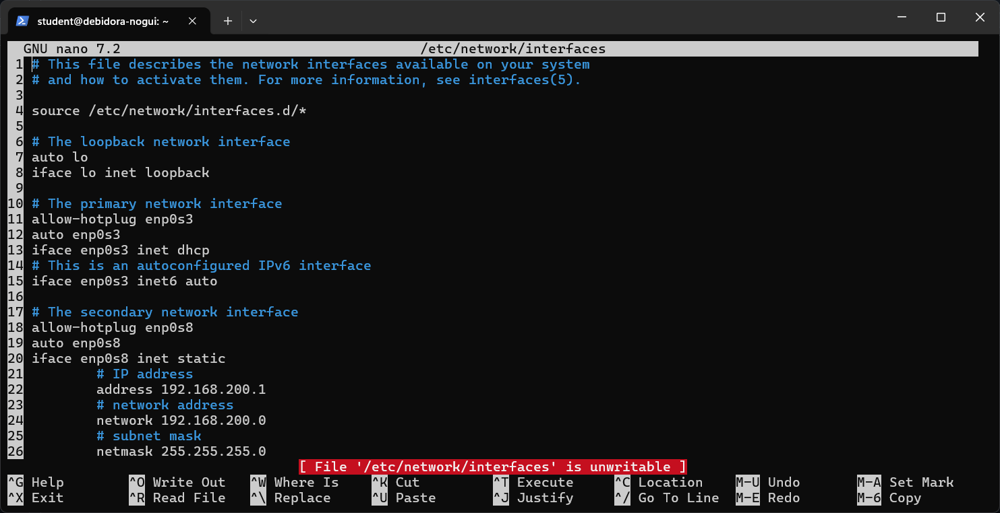
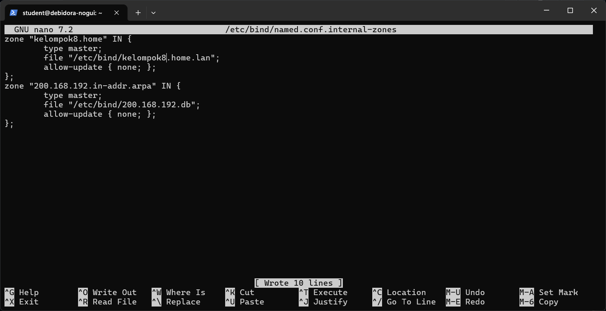

# Laporan Praktikum Workshop Administrasi Jaringan Week-6

<p align="center">
  
</p>

## Dosen Pengampu  
**Dr. Ferry Astika Saputra, ST, M.Sc**  

## Disusun Oleh  
- **Nama**: Muhammad Arief Wicaksono Putra Santoso  
- **Kelas**: 2 D3 IT A  
- **NRP**: 3123500022  
- **Program Studi**: D3 Teknik Informatika  
- **Politeknik Elektronika Negeri Surabaya**  
- **Tahun Ajaran**: 2025/2026  

---

## Daftar Isi
- [Laporan Praktikum Workshop Administrasi Jaringan Week-6](#laporan-praktikum-workshop-administrasi-jaringan-week-6)
  - [Dosen Pengampu](#dosen-pengampu)
  - [Disusun Oleh](#disusun-oleh)
  - [Daftar Isi](#daftar-isi)
  - [Instalasi Virtual Machine No-GUI (VM 1)](#instalasi-virtual-machine-no-gui-vm-1)
  - [Konfigurasi Virtual Machine No-GUI (VM 1)](#konfigurasi-virtual-machine-no-gui-vm-1)
  - [Instalasi NTP Client](#instalasi-ntp-client)
  - [Instalasi Samba](#instalasi-samba)
  - [Instalasi Bind9 (DNS)](#instalasi-bind9-dns)
---

## Instalasi Virtual Machine No-GUI (VM 1)
Step 1:<br>
Unduh file ZIP virtual machine no-GUI di `https://drive.google.com/drive/folders/1Rnv4prB4BbsOebonX2GTHu6f1k6oQEZ4`.
<br>Gambar:

<p align="center">
  
</p>

Step 2:<br>
Ekstrak file ZIP yang telah diunduh, dan masuk ke dalam folder debian12-10-nogui > debidora-nogui.
<br>Gambar:

<p align="center">
  
</p>

Setelah di ekstrak maka file nogui bisa digunakan

<p align="center">
  
</p>

Step 3:<br>
Buka file debidora-nogui yang memiliki ikon biru, lalu virtual box akan otomatis akan terbuka dan virtual machine no-GUI akan terbuat.
<br>Gambar:
<p align="center">
  
</p>

Step 4:<br>
Tekan settings dengan memilih debidora-nogui, lalu menuju menu network. Ubah adapter 1 menjadi bridged network dan adapter 2 menjadi internal network. Tekan OK untuk menyimpan perubahan.
<br>Gambar:
<p align="center">
  
</p>

<p align="center">
  
</p>

---
## Konfigurasi Virtual Machine No-GUI (VM 1)
Langkah 1:<br>
Login dengan menggunakan student sebagai username dan password.
<p align="center">
  
</p>

Langkah 2:<br>
Jalankan perintah `ip a` untuk melihat ip address dan ambil ip dari interface enp0s3. Buka terminal atau command prompt pada window host, jalankan command ssh student@\[IP-Address-enp0s3] dan login seperti dalam VM untuk menggunakan VM no-GUI dalam terminal windows.
<br>Gambar:


Langkah 3:<br>
Setelah itu, Konfigurasikan jaringan dan cek dengan menggunakan perintah `nano -l -w /etc/network/interfaces`.
<br>Gambar:



Langkah 4:<br>
Konfigurasi `sysctl.conf` untuk menghapus comment pada bagian `net.ipv4.ip_forward=1` dengan menggunakan perintah `nano -l -w /etc/sysctl.conf`.
<br>Gambar:


Langkah 5:<br>
Unduh package `iptables` dan `iptables-persistent` dengan menggunakan perintah `sudo apt-get install iptables iptables-persistent`.
<br>Gambar:


Langkah 6:<br>
tambahkan baris kode berikut kedalam `/etc/iptables/rules.v4` menggunakan perintah `sudo nano -l -w /etc/iptables/rules.v4`.
```bash
*nat
 -A POSTROUTING -o enp0s3 -j MASQUERADE
 COMMIT

 *filter
 -A INPUT -i lo -j ACCEPT
 # allow ssh, so that we do not lock ourselves
 -A INPUT -i enp0s3 -p tcp -m tcp --dport 22 -j ACCEPT
 # allow incoming traffic to the outgoing connections,
 # et al for clients from the private network
 -A INPUT -m state --state RELATED,ESTABLISHED -j ACCEPT
 # prohibit everything else incoming
 -A INPUT -i enp0s3 -j DROP
 COMMIT
```
<br>Gambar:


Langkah 7:<br>
Jalankan perintah `sudo iptables-restore < /etc/iptables/rules.v4` untuk mengembalikan aturan-aturan iptables dari file konfigurasi yang telah disimpan sebelumnya.
<br>Gambar:


Langkah 8:
Lakukan reboot VM dengan menggunakan perintah `sudo reboot`.
<br>Gambar:


## Instalasi NTP Client
Langkah 1:
Instalasi NTP Client menggunakan perintah `sudo apt -y install ntpsec`.
<br>Gambar:


Langkah 2:
Setelah selesai instalasi, gunakan perintah `sudo nano /etc/ntpsec/ntp.conf` untuk mengakses file konfigurasi NTP Client.
<br>Gambar:


Langkah 3:
Pada dalam ntp.conf, beri komen (#) pada pool ke empat pool yang ada dan masukkan server Indonesia yang dapat disalin dari web `https://www.ntppool.org/en/zone/id`.
<br>Gambar:


Langkah 4:
Setelah konfigurasi, lakukan restart untuk NTP Client untuk menggunakan konfigurasi yang baru dengan perintah `sudo systemctl restart ntpsec`.
<br>Gambar:


Langkah 5:
Untuk melihat jika sudah tersambung dengan server, gunakan perintah `ntpq -p`.
<br>Gambar:


Langkah 6:
Periksa waktu NTP Client dengan menggunakan perintah `sudo systemctl status ntpsec`.
<br>Gambar:


## Instalasi Samba
Langkah 1:<br>
unduh package samba dengan menggunakan perintah `sudo apt -y install samba`.
<br>Gambar:


Langkah 2:<br>
Membuat direktori dengan menggunaakn perintah `sudo mkdir /home/public`.
<br>Gambar:


Langkah 3:<br>
Merubah akses agar semua dapat write, read, dan excute dengan perintah `sudo chmod 777 /home/public`.
<br>Gambar:


Langkah 4:<br>
Konfigurasi file samba menggunakan perintah `sudo nano /etc/samba/smb.conf`.
<br>Gambar:


Langkah 5:<br>
Menambahkan `unix charset = UTF-8` untuk kompatibilitas dengan sistem yang mendukung pengkodean UTF-8.
<br>Gambar:


Langkah 6:<br>
Menambahkan interface sesuai dengan alamat IP yang akan digunakan.
<br>Gambar:


Langkah 7:<br>
Menambahkan konfigurasi folder public.
<br>Gambar:


Langkah 8:<br>
Melakukan restart dengan perintah `sudo systemctl restart smbd`.
<br>Gambar:


Langkah 9:<brd>
Lakukan pengecekan akses samba dalam VM 1 yang menggunakan IP Statik [smb://192.168.200.1] dengan menggunakan VM 2.
<br>Gambar:


-----

## Instalasi Bind9 (DNS)
Langkah 1:<br>
Instalasi BIND menggunakan perintah `sudo apt -y install bind9 bind9utils`.
<br>Gambar:


Langkah 2:<br>
Konfigurasi BIND untuk network internal dalam named.conf menggunakan perintah `sudo nano /etc/bind/named.conf` untuk menambahkan `include "/etc/bind/named.conf.internal-zones";`.
<br>Gambar:


Langkah 3:<br>
Konfigurasi BIND untuk network internal dalam named.conf.options menggunakan perintah `sudo nano /etc/bind/named.conf.options` untuk menambahkan: 
```bash
        acl internal-network {
                192.168.200.0/24;
        };
...
...
        allow-query { localhost; internal-network; };
        allow-transfer { localhost; };
        listen-on port 53 { any; };
        recursion yes;
```
Gambar:


Langkah 4:<br>
Konfigurasi BIND untuk network internal dalam named.conf.internal-zones menggunakan perintah `sudo nano /etc/bind//etc/bind/named.conf.internal-zones` untuk menambahkan:<br>
```bash
zone "kelompok8.home" IN {
        type master;
        file "/etc/bind/kelompok8.home.lan";
        allow-update { none; };
};
zone "200.168.192.in-addr.arpa" IN {
        type master;
        file "/etc/bind/200.168.192.db";
        allow-update { none; };
};
```
Gambar:




Langkah 5:<br>
Konfigurasi BIND untuk network internal dalam /default/named menggunakan perintah `sudo nano /etc/default/named` untuk menambahkan:<br>
```bash
# add
OPTIONS="-u bind -4"
```
Gambar:


Langkah 6:<br>
Membuat file zona yang digunakan server untuk menyelesaikan alamat IP dari nama domain, menggunakan perintah `sudo nano /etc/bind/kelompok8.home.lan`.
<br>Gambar:


Langkah 7:<br>
Buat file zona yang memungkinkan server mengubah nama domain menjadi alamat IP menggunakan perintah `sudo nano /etc/bind/200.168.192.db`.
<br>Gambar:


Langkah 8:<br>
Restart BIND untuk menyimpan perubahan menggunakan `sudo systemctl restart named`.
<br>Gambar:


Langkah 9:<br>
Merubah pengaturan DNS untuk merujuk ke DNS sendiri pada `sudo nano /etc/resolv.conf`.
<br>Gambar:


Langkah 10:<br>
Pada VM 2, ubah adapter 1 di setting > Network menjadi internal network.
<br>Gambar:


Langkah 11:<br>
Konfigurasi jaringan Wired menjadi IP statik seperti yang tertera pada gambar. Jika sudah, klik apply untuk menyimpan perubahan.
<br>Gambar:


Langkah 12:<br>
Jika VM 2 sudah terhubung dengan VM 1 melalui internal network, lakukan pengecekan DNS yang ada pada VM 1 dengan menggunakan `dig ns.kelompok8.home.` dan `dig -x 192.168.200.1`. Indikasi berhasilnya DNS pada VM 1 dapat dilihat dari flag `ANSWER: 1` atau lebih dan dengan `status: NOERROR`
<br>Gambar:


