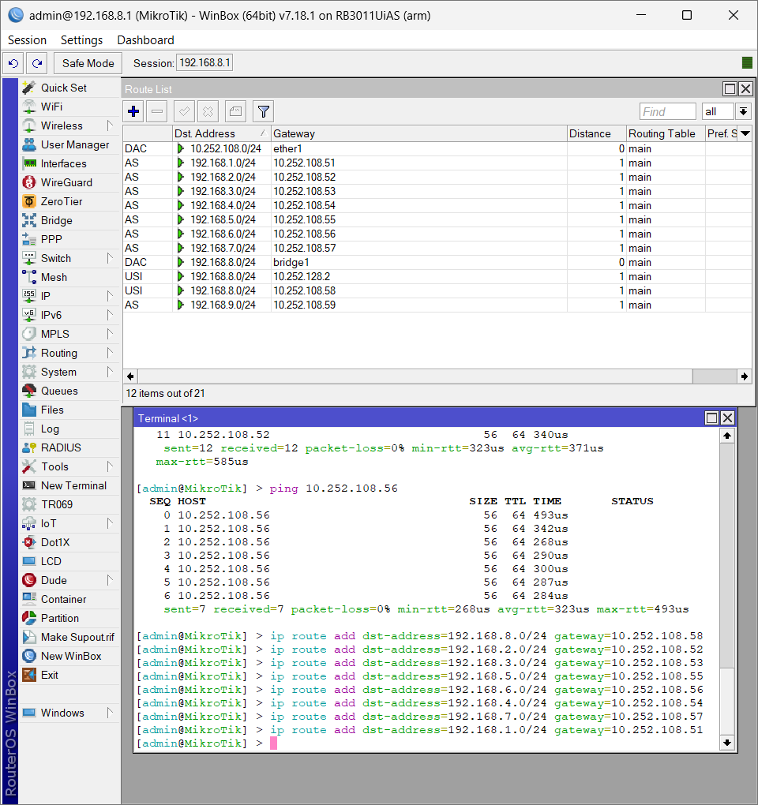
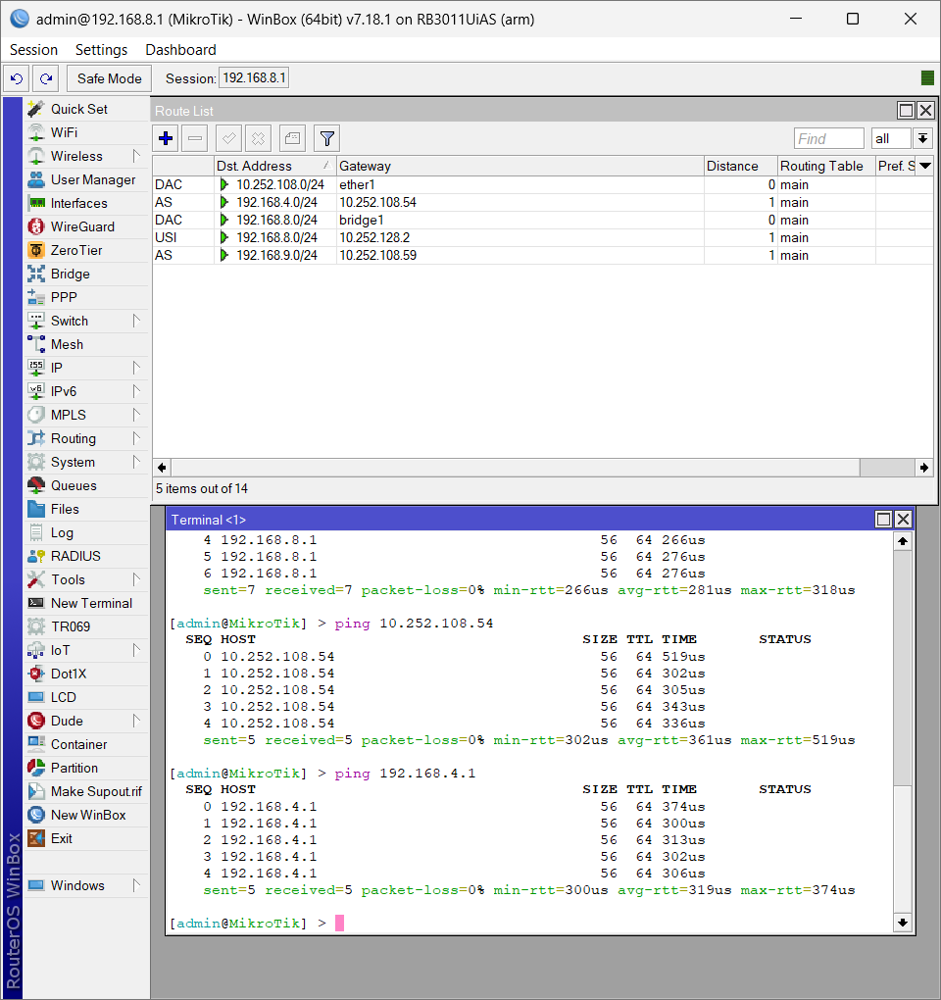

# Laporan Praktikum Workshop Administrasi Jaringan Week-7

<p align="center">
  
</p>

## Dosen Pengampu  
**Dr. Ferry Astika Saputra, ST, M.Sc**  

## Disusun Oleh  
- **Nama**: Muhammad Arief Wicaksono Putra Santoso  
- **Kelas**: 2 D3 IT A  
- **NRP**: 3123500022  
- **Program Studi**: D3 Teknik Informatika  
- **Politeknik Elektronika Negeri Surabaya**  
- **Tahun Ajaran**: 2025/2026  

---

## Setting mikrotik

### 1. Tambah IP STATIS Kelompok lain ( Kelompok 1-10) beserta gatewaynya masing masing.

Untuk menambahkan alamat IP statis ke perangkat dengan gateway MikroTik, gunakan WinBox untuk membuka terminal baru, lalu jalankan perintah berikut:
`/ip route add dst-address=192.168.x.0/24 gateaway=10.252.108.5x` 
X itu untuk misalnya kelompok 1 itu Xnya diganti 1. Contoh menambahkannya ada gambar dibawah ini : 



Gambar diatas itu ada IP dari kelompok 1-10

### 2. Test Ping IP Kelompok lain
Untuk Test Ping ke kelompok lain anda bisa menggunakan perintah `ping 192.168.X.1` X itu untuk Kelompok. Contohnya ada digambar dibawah ini : 



Test ping menunjukan hasil dibawah ini. Dari gambar diatas menunjukkan pesan TTL maka pc anda dengan pc kelompok lain sudah terhubung.

```bash 

Misalnya :
# TTL = PC bisa mengirim paket pc lain. dan sudah terhubung.

## RTO = indikasi bahwa pengirim belum menerima paket. Ketika waktu RTO habis tanpa menerima konfirmasi, sistem mengasumsikan bahwa:
- Paket mungkin hilang dalam perjalanan
- Konfirmasi penerimaan mungkin hilang dalam perjalanan
- Terjadi kemacetan jaringan yang signifikan

### Unreachable = berarti suatu host atau jaringan tidak dapat dijangkau / PC anda dan kelompok lain belum terhubung.

```

