# Laporan Praktikum Workshop Administrasi Jaringan Week-8

<p align="center">
  
</p>

## Dosen Pengampu  
**Dr. Ferry Astika Saputra, ST, M.Sc**  

## Disusun Oleh  
- **Nama**: Muhammad Arief Wicaksono Putra Santoso  
- **Kelas**: 2 D3 IT A  
- **NRP**: 3123500022  
- **Program Studi**: D3 Teknik Informatika  
- **Politeknik Elektronika Negeri Surabaya**  
- **Tahun Ajaran**: 2025/2026  

---

## Instalasi Bind9
### 1. Instalasi
Instalasi BIND menggunakan perintah `sudo apt -y install bind9 bind9utils`.
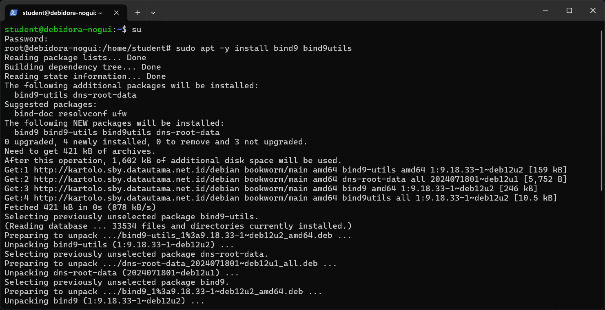
untuk contoh seperti diatas. saya lupa foto untuk instalasi bind9 saat di lab. karena itu saya pakai foto ini


### 2. Setting named.conf
Gunakan Perintah `sudo nano /etc/bind/named.conf`
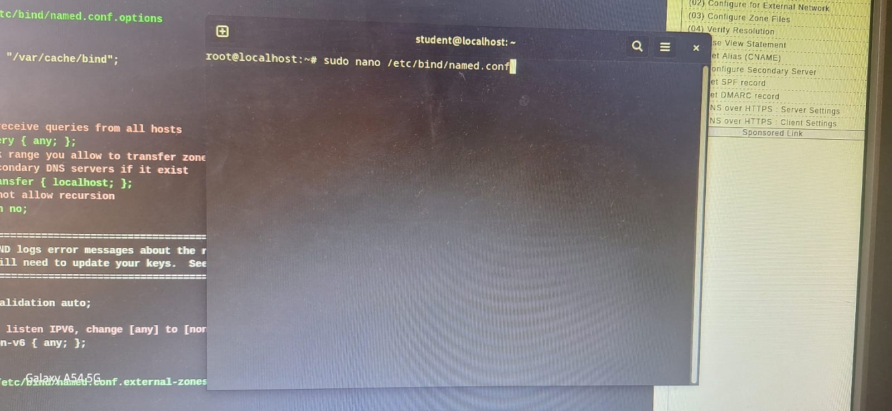

Tambahkan `include "/etc/bind/named.conf.internal-zones";` dibawahnya `include "/etc/bind/named.conf.default-zones"`

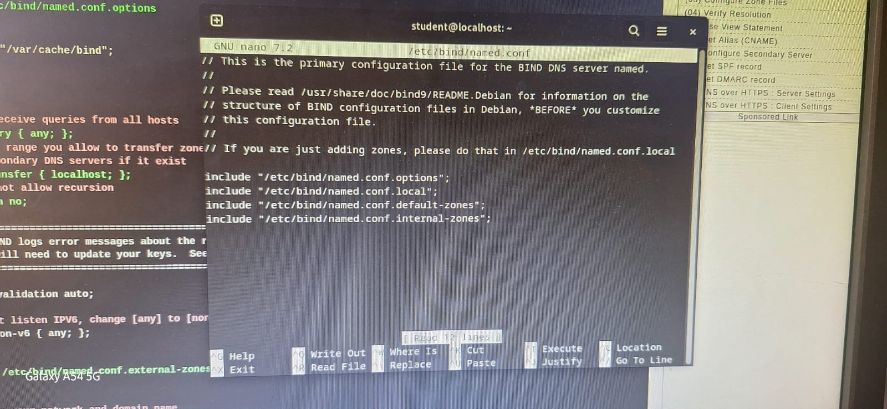


### 3. Setting named.conf.options
Gunakan perintah ini `sudo nano /etc/bind/named.conf.options`

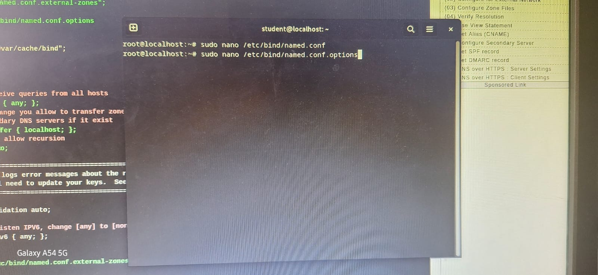
Lalu tambahkan 

```bash
        acl internal-network {
                192.168.8.0/24;
        };
```

ini ditaruh diatas 

```bash 
option { 
    directory "var/cache/bind";
}
```
dan tambahkan ini 
```bash
        allow-query { localhost; internal-network; };
        allow-transfer { localhost; };
        listen-on port 53 { any; };
```
tambahkan ini dibawah 
```bash
// uncomment dan atur forwarders jika perlu.
// forwarders{
//      0.0.0.0;
// };
```
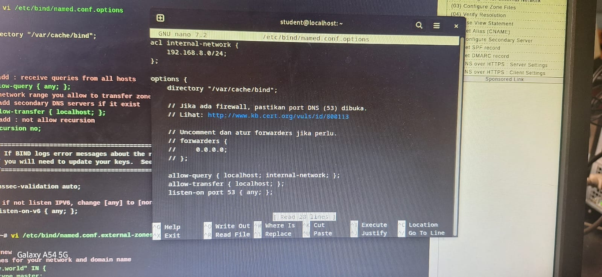

### 4. Setting named.conf.internal-zones


### 5. Setting /etc/default/named
Gunakan perintah `sudo nano /etc/default/named`
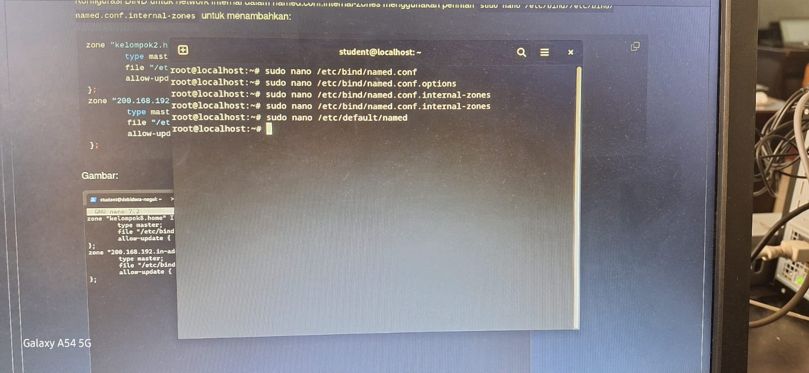

Tambahkan
```bash 
OPTIONS="-u bind -4"
``` 
Dibawah `# startup option for the server` seperti gambar dibawah :

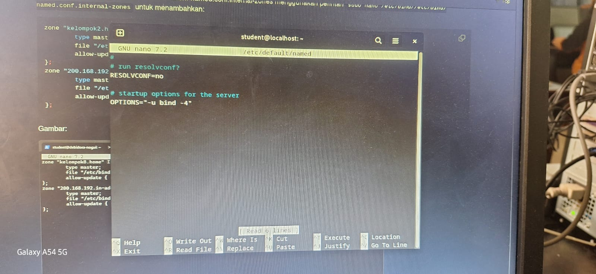

### 6. Setting /etc/bind/kelompok8.home.lan
Gunakan perintah `sudo nano /etc/bind/kelompok8.home.lan`

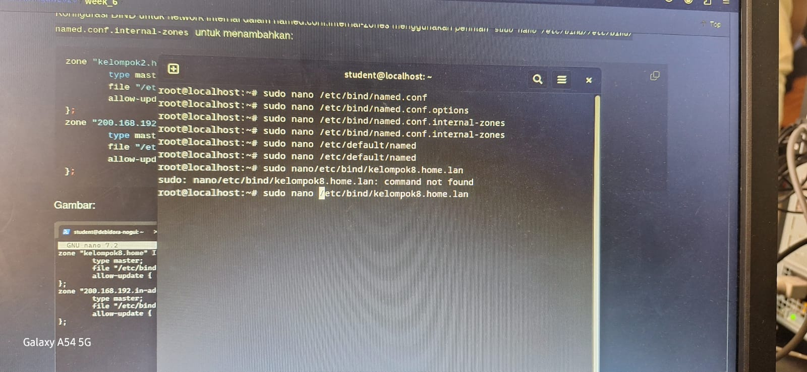

Lalu tambahkan Seperti gambar dibawah : 

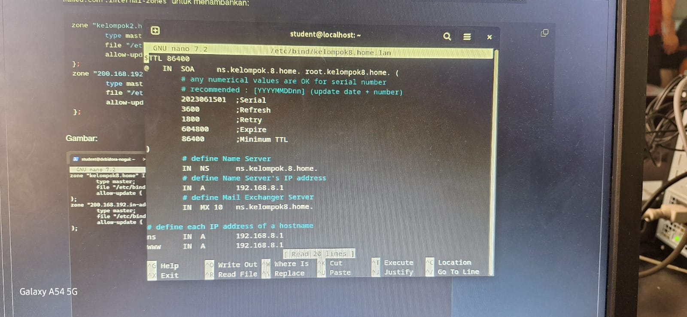

### 7. Setting /etc/bind/8.168.192.db
Gunakan perintah `sudo nano /etc/bind/8.168.192.db`
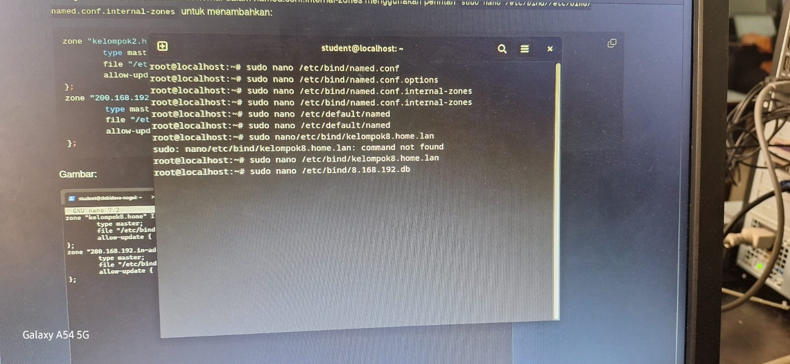

Lalu tambahkan seperti gambar dibawah : 

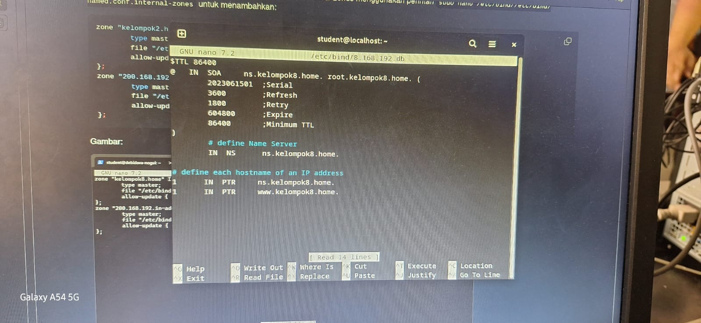

### 8. Restart named
Gunakan `sudo systemctl restart named` untuk merestart
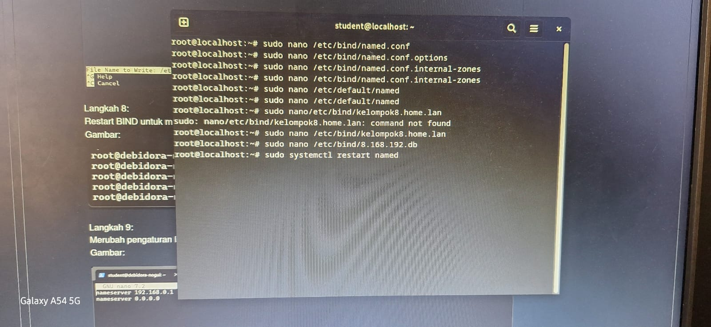

### 9. Setting /etc/resolv.conf
Gunakan perintah `sudo nano /etc/resolv.conf`

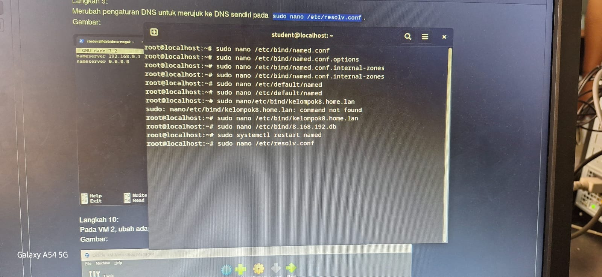

Lalu tambahkan seperti gambar dibawah : 

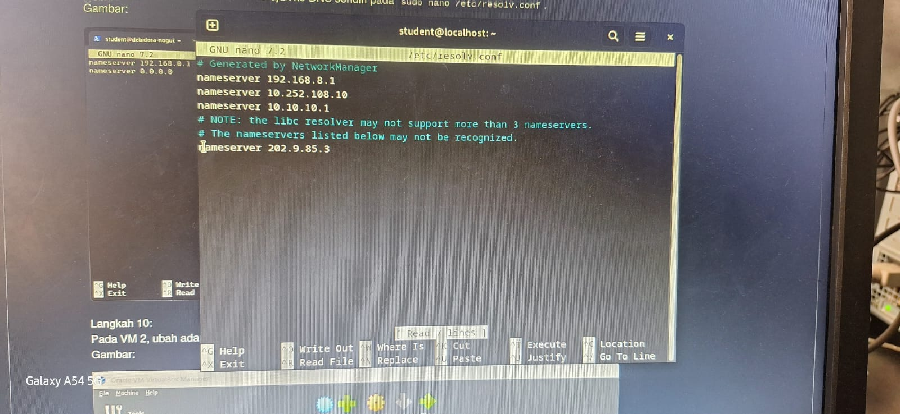

---
## Instalasi Apache2

### 1. Instalasi Apache2