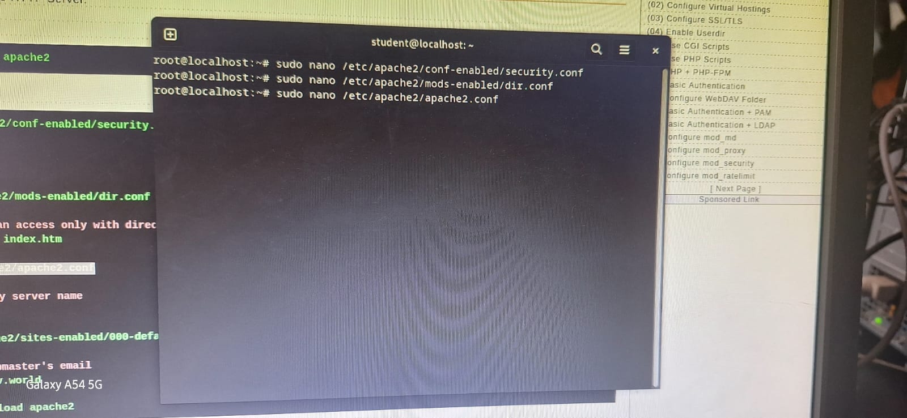
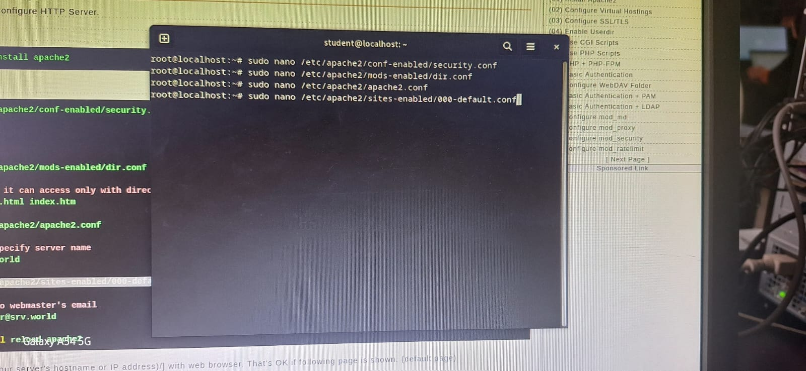

# Laporan Praktikum Workshop Administrasi Jaringan Week-9

<p align="center">
  
</p>

## Dosen Pengampu  
**Dr. Ferry Astika Saputra, ST, M.Sc**  

## Disusun Oleh  
- **Nama**: Muhammad Arief Wicaksono Putra Santoso  
- **Kelas**: 2 D3 IT A  
- **NRP**: 3123500022  
- **Program Studi**: D3 Teknik Informatika  
- **Politeknik Elektronika Negeri Surabaya**  
- **Tahun Ajaran**: 2025/2026  

---

## Instalasi Apache2

### 1. Instalasi Apache2
Gunakan perintah `sudo apt -y install apache2` untuk menginstall apache2


### 2. Setting /etc/apache2/conf-enabled/security.conf
Gunakan perintah `sudo nano /etc/apache2/conf-enabled/security.conf` seperti gambar dibawah : 


Tambahkan dibawah ini sesuai foto yang saya berikan dibawah:
```bash

ServerTokens OS
ServerTokens Prod

```


### 3. Setting /etc/apache/mods-enabled/dir.conf
Gunakan perintah `sudo nano /etc/apache/mods-enabled/dir.conf` untuk membuka /etc/apache/mods-enabled/dir.conf


Lalu ketik sesuai gambar dibawah ini : 


### 4. Setting /etc/apache2/apache2.conf
Gunakan perintah `sudo nano /etc/apache2/apache2.conf` 



Lalu ketik seperti contoh dibawah sesuai contoh gambar : 

```bash

ServerName www.kelompok8.home

```


### 5. Setting /etc/apache2/sites-enabled/000-default.conf
Gunakan perintah `sudo nano /etc/apache2/sites-enabled/000-default.conf` untuk konfigurasi virtual host default Apache untuk port HTTP 



Lalu ketik perintah ini sesuai dari contoh gambar dibawah : 

```bash 

ServerAdmin webmaster@kelompok8.home
DocumentRoot /var/www/html

```


### 6. Reload apache2 service

Gunakan perintah `systemctl reload apache2.service`  untuk memuat ulang (reload) konfigurasi Apache tanpa menghentikan layanan Apache yang sedang berjalan 


### 7. Hasil dari Web Server
Gunakan IP `192.168.8.10` di browser untuk melihat apache2 web server sudah berfungsi atau belum. jika muncul seperti gambar dibawah maka web server-nya sudah aktif dan berjalan dengan baik.


----


`KomowDO`